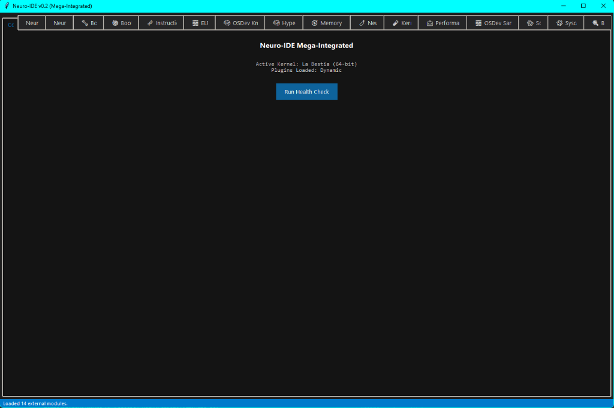
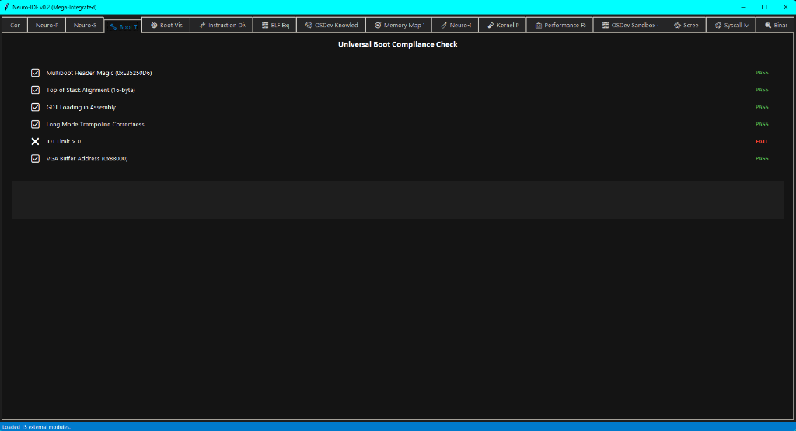
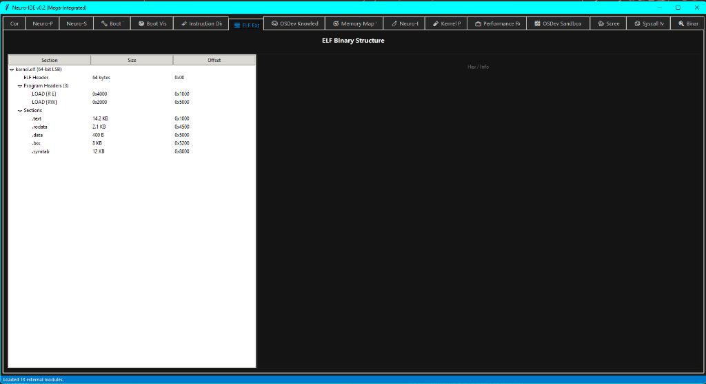
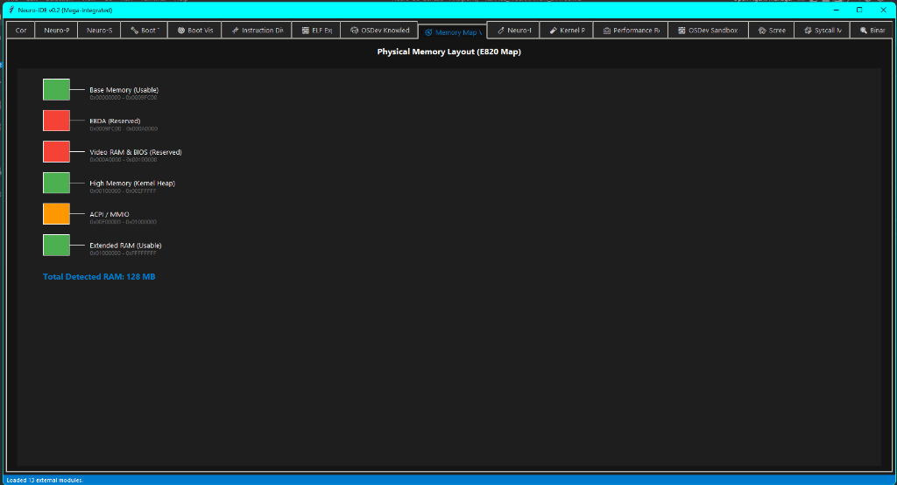
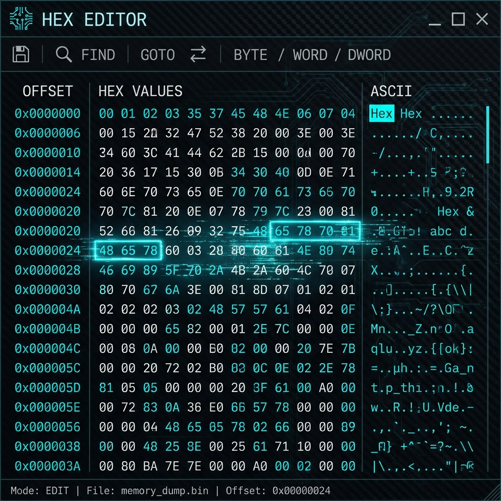
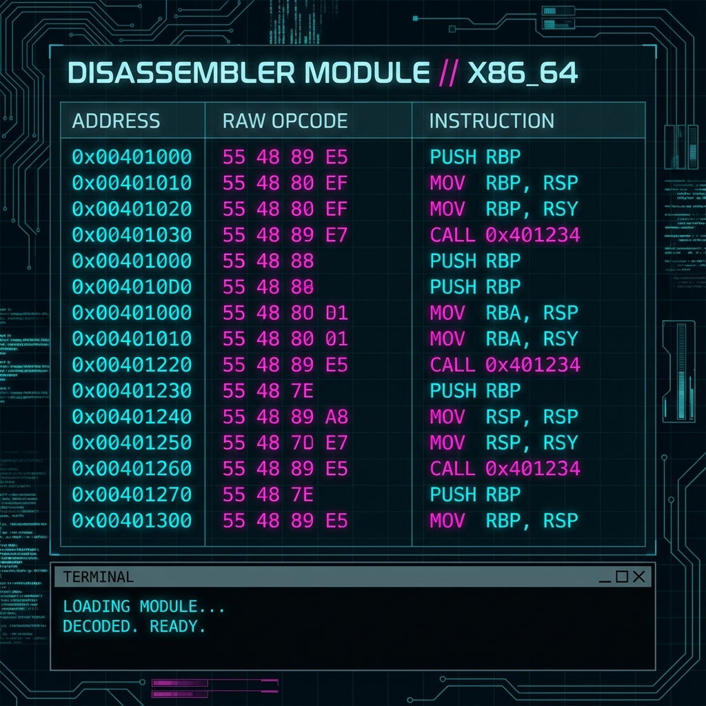
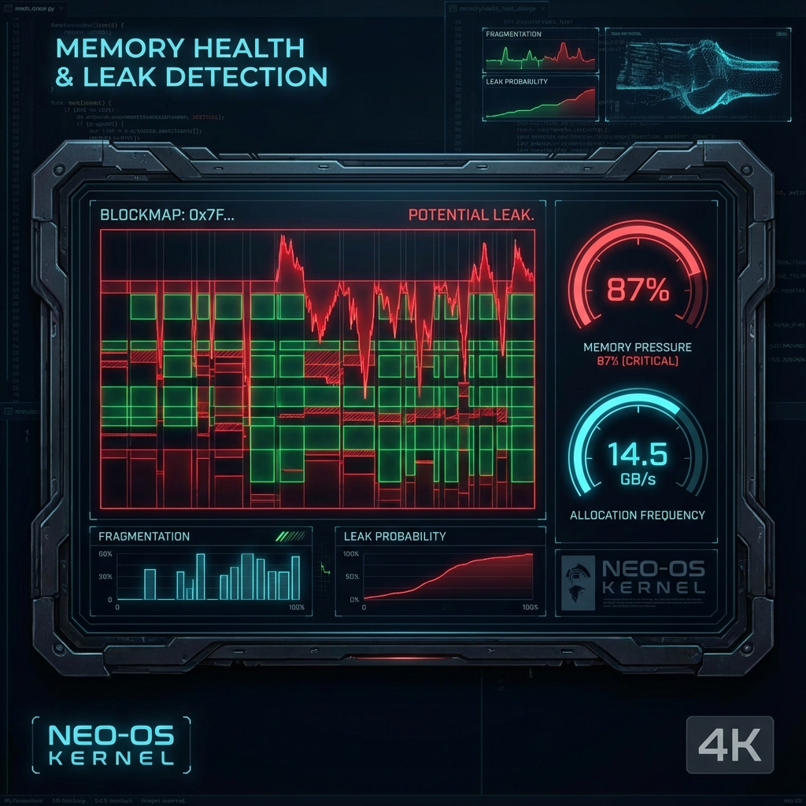
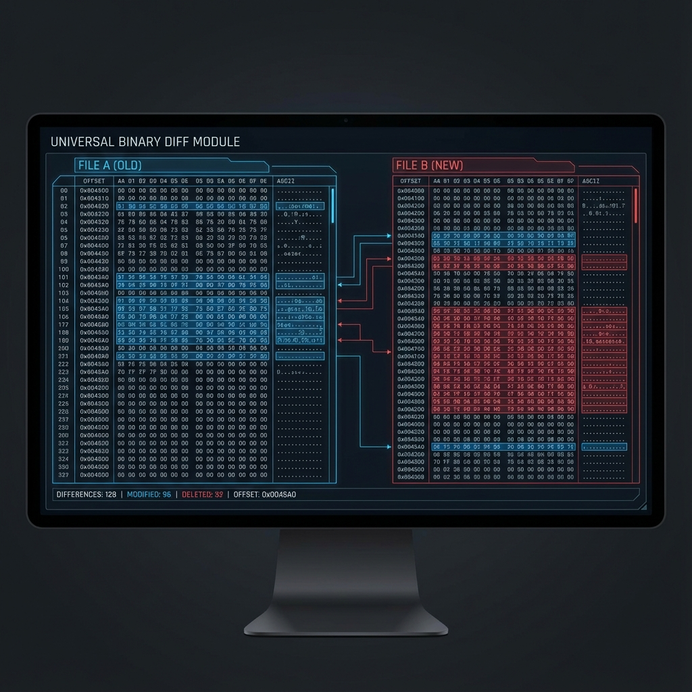

# 🖼️ Neuro-IDE v0.2.3: Visual Showcase (Surgical Suite)
### *Dissecting Silicon | Narrating the Machine*

Esta galería muestra el arsenal visual completo del **Neuro-IDE v0.2.3**.
This gallery showcases the complete visual arsenal of **Neuro-IDE v0.2.2**.

---

## 🚀 1. Dashboard (The Cortex)

- **EN:** Central mission control for procedural logs (Surgical Suite).
- **ES:** Control central de misión para logs procedimentales (Surgical Suite).

## 🩺 2. Neuro-Doctor (Diagnostics)

- **EN:** Heuristic analysis for kernel panics and #UD.
- **ES:** Análisis heurístico para fallos del kernel y #UD.

## 📡 3. Neuro-Scope (Visual Timeline)

- **EN:** High-speed serial log visualizer with zoom.
- **ES:** Visualizador de logs serie con zoom dinámico.

## 🔍 4. ELF Explorer (Binary Deep Dive)

- **EN:** Full dissection of 64-bit kernel binaries.
- **ES:** Disección completa de binarios de kernel de 64 bits.

## 🗺️ 5. BootViz (Memory Map)

- **EN:** E820 physical memory visualization.
- **ES:** Visualización de memoria física E820.

## 🛠️ 6. Hex Editor (Surgical Byte Edit)

- **EN:** Low-level manipulation of bin files.
- **ES:** Manipulación de bajo nivel de archivos binarios.

## ⚙️ 7. Disassembler (ASM View)

- **EN:** Translating binary opcodes to x86_64 instructions.
- **ES:** Traducción de opcodes binarios a instrucciones x86_64.

## 🏥 8. Memory Health (Leak Check)

- **EN:** Visual heatmaps for heap allocations and leaks.
- **ES:** Mapas de calor visuales para asignaciones y fugas.

## ⚖️ 9. Universal Binary Diff (UBD)

- **EN:** Bitwise comparison between kernel versions.
- **ES:** Comparativa bit a bit entre versiones del kernel.

## 🧠 10. IA Gating Orchestrator

- **EN:** Real-time monitoring of the Neural Gating System.
- **ES:** Monitorización en tiempo real del Sistema de Gating Neuronal.

## 📡 11. Syscall Mapper

- **EN:** Tracking the Kernel/Userland boundary.
- **ES:** Rastreo del límite entre Kernel y Usuario.

## 🧩 12. Knowledge Graph

- **EN:** Multi-dimensional dependency mapping.
- **ES:** Mapeo de dependencias multidimensional.

## ⚖️ 13. ScreenDiff (UI Validation)

- **EN:** Pixel-perfect visual regression testing.
- **ES:** Pruebas de regresión visual píxel a píxel.

## 🧪 14. OSDev Sandbox

- **EN:** Safe environment for isolated kernel testing.
- **ES:** Entorno seguro para pruebas aisladas de kernel.

## 📈 15. Profiler (Performance)

- **EN:** Boot time and resource trend monitoring.
- **ES:** Monitorización de tiempos de arranque y tendencias.

## 🌐 16. Universal Localization (Multi-Lang)

- **EN:** Support for 11+ languages with dynamic switching.
- **ES:** Soporte para 11+ idiomas con cambio dinámico.

## 🧬 17. Instruction Divergence

- **EN:** Tracking architectural drift in kernel code.
- **ES:** Rastreo de derivas arquitectónicas en el código.

## 🕹️ 18. Boot Readiness (Checklist)

- **EN:** Pre-flight checks for bare metal deployment.
- **ES:** Chequeos previos al despliegue en hardware real.

---
**Neuro-IDE v0.2.2** | *Surgical Suite Edition*
@José Manuel Moreno Cano / neuro-os genesis
