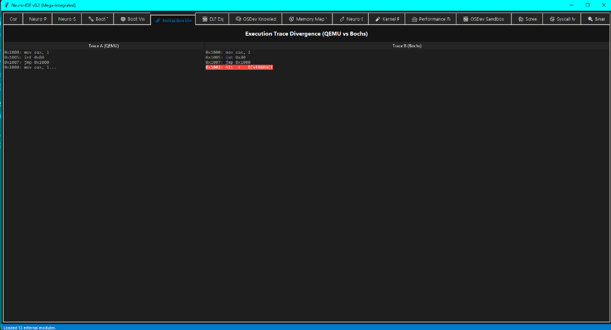
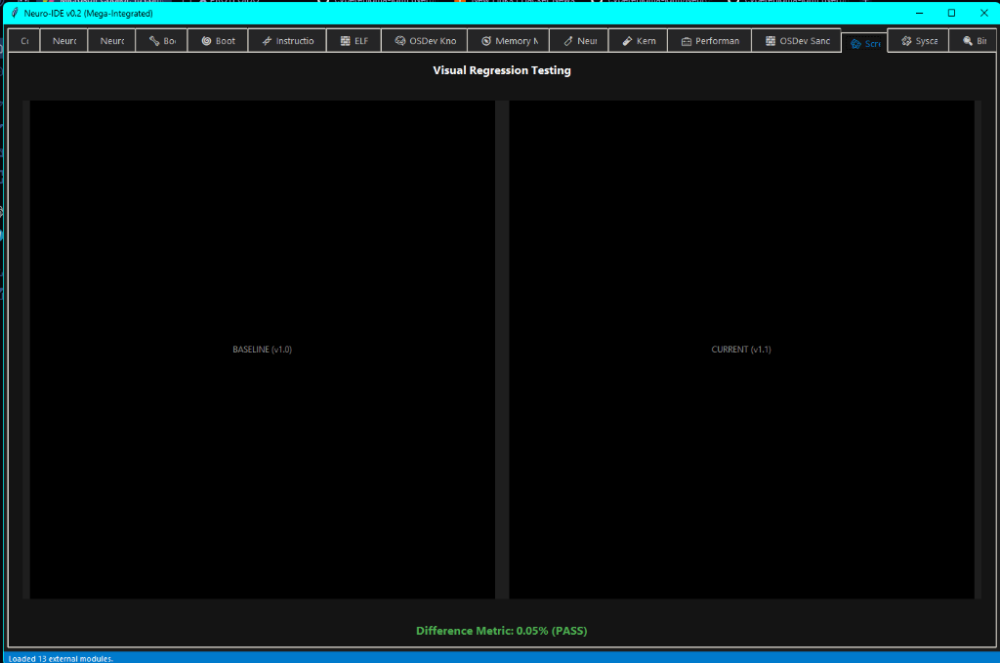
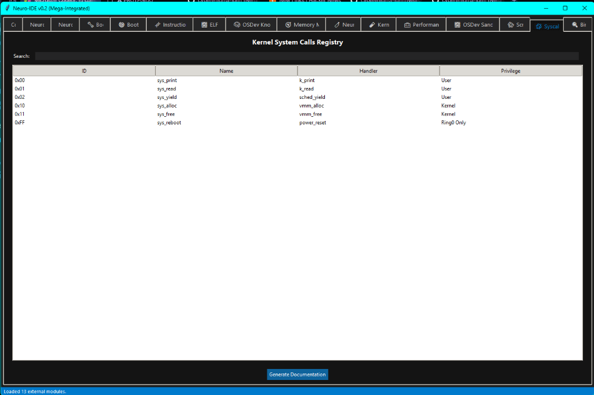
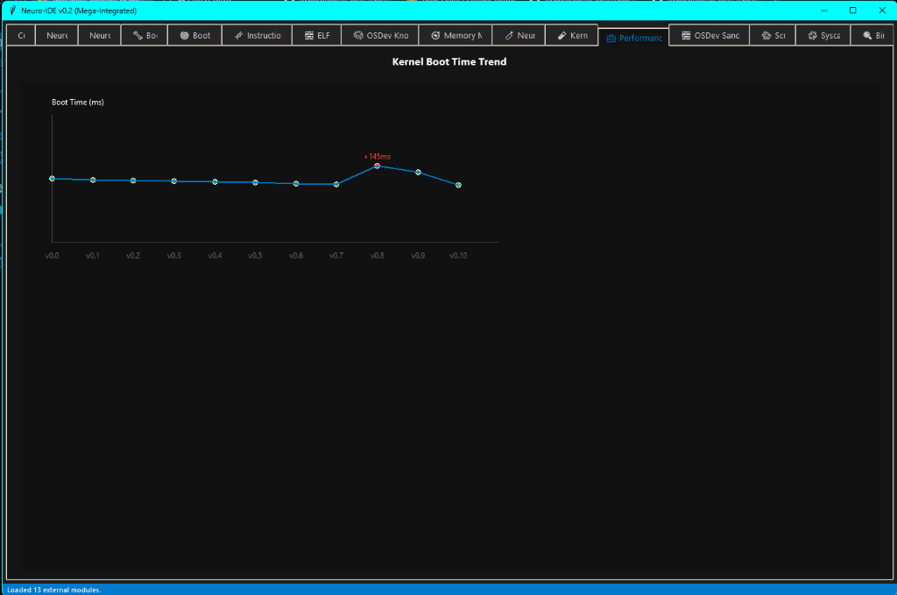

# 🖼️ Neuro-IDE v0.2: Feature Tour & Case Studies

Este documento no es solo una galería; es una guía de lo que puedes lograr con la **Corteza**. Aquí explicamos cada funcionalidad con ejemplos reales de uso.

---

## 🚀 1. El Centro de Mando (Dashboard)

**¿Qué estás viendo?** La interfaz principal "Cortex". 
- **Ejemplo de uso:** Al arrancar el IDE, obtienes una vista de pájaro de todos los módulos activos. Aquí puedes ver el estado de salud de la sesión y acceder rápidamente al Storyteller o al Neuro-Doctor.
- **Utilidad:** Centraliza el flujo de trabajo para que no tengas que saltar entre diferentes herramientas de terminal.

## 🩺 2. Neuro-Doctor (Boot Compliance)

**¿Qué estás viendo?** El motor de validación de arranque universal.
- **Ejemplo de uso:** Tu kernel funciona en QEMU pero se queda en negro en tu portátil real. El Doctor analiza los metadatos de arranque y detecta que falta un encabezado multiboot válido o que la arquitectura de 64 bits no se activó correctamente.
- **Utilidad:** Ahorra horas de depuración a ciegas en hardware real.

## 📡 3. Neuro-Scope (Instruction Divergence)

**¿Qué estás viendo?** Un análisis de divergencia en el flujo de ejecución.
- **Ejemplo de uso:** Al comparar dos ejecuciones del mismo código, el Scope nota que en la segunda vez el kernel tomó un camino diferente (un `if` fallido inesperado). 
- **Utilidad:** Detectar "Heisenbugs" o condiciones de carrera donde el comportamiento cambia de forma aleatoria.

## 🔍 4. ELF Explorer (Anatomía Binaria)

**¿Qué estás viendo?** El desglose interno del archivo ejecutable de tu kernel.
- **Ejemplo de uso:** Estás intentando llamar a una función y el sistema explota. Usas el Explorer para confirmar que la dirección de esa función está realmente en la sección `.text` (ejecutable) y no en `.rodata` (solo lectura).
- **Utilidad:** Verificar el trabajo del Linker Script (`linker.ld`).

## 🧩 5. Knowledge Graph (Dependencias)

**¿Qué estás viendo?** Un mapa visual de cómo se relacionan los conceptos de tu proyecto.
- **Ejemplo de uso:** Estás rediseñando el sistema de archivos (Filesystem). El Grafo te muestra qué otros módulos dependen de él, permitiéndote prever errores antes de cambiar una sola línea de código.
- **Utilidad:** Mantener el control sobre la complejidad creciente del sistema.

## 🗺️ 6. BootViz (Mapa de Memoria E820)

**¿Qué estás viendo?** La distribución física de la RAM detectada por el BIOS.
- **Ejemplo de uso:** Necesitas reservar 1GB para tu motor gráfico. BootViz te muestra visualmente dónde hay un hueco "Usable" lo suficientemente grande y si hay zonas reservadas por el fabricante que debes evitar.
- **Utilidad:** Gestión de memoria física sin errores de solapamiento.

## 🧪 7. OSDev Sandbox (Generador de Proyectos)

**¿Qué estás viendo?** El asistente de creación de entornos aislados.
- **Ejemplo de uso:** Quieres probar una nueva idea para un planificador (Scheduler) sin romper tu kernel principal. El Sandbox crea una mini-estructura de kernel funcional en segundos para que experimentes.
- **Utilidad:** Prototipado rápido y seguro.

## ⚖️ 8. Regression Testing (Screen Diff)

**¿Qué estás viendo?** Comparativa visual de la salida en pantalla (VGA/VESA).
- **Ejemplo de uso:** Has cambiado el driver de fuentes. El IDE compara un "pantallazo" del kernel antiguo con el nuevo para marcarte exactamente qué píxeles han cambiado.
- **Utilidad:** Asegurar que los cambios visuales no rompen la interfaz del shell.

## 📡 9. Syscall Mapper

**¿Qué estás viendo?** El registro de llamadas al sistema.
- **Ejemplo de uso:** Un programa de usuario está fallando. El Mapper captura el momento exacto en que se llamó a la syscall `write` y qué argumentos se pasaron, permitiéndote ver si el error está en el programa o en el kernel.
- **Utilidad:** Depuración de la interfaz entre usuario y núcleo.

## 🚀 10. Performance Monitor

**¿Qué estás viendo?** Gráficos de tiempo de arranque y consumo de ciclos.
- **Ejemplo de uso:** Después de añadir el soporte ACPI, el kernel tarda 2 segundos más en arrancar. El Monitor te muestra el pico de consumo de tiempo en el módulo específico.
- **Utilidad:** Optimización de la velocidad de inicio de "La Bestia".

---
**Desarrollado con ❤️ por José Manuel Moreno Cano**
*Neuro-IDE: Porque crear un Sistema Operativo es una aventura, no solo una tarea.*
