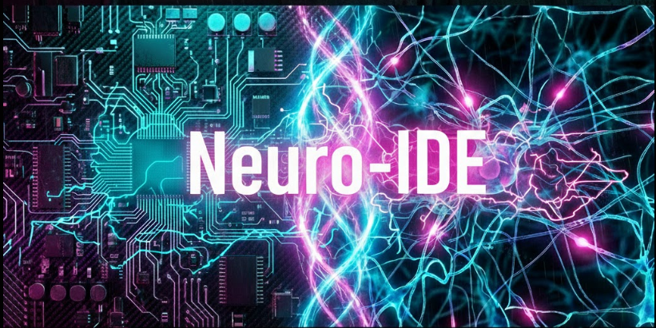
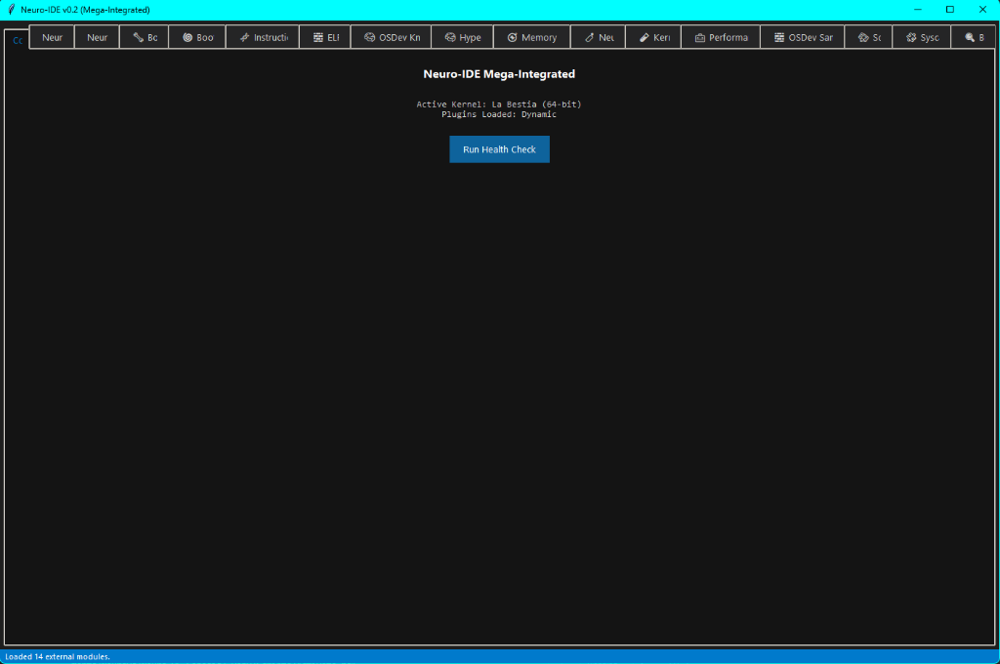
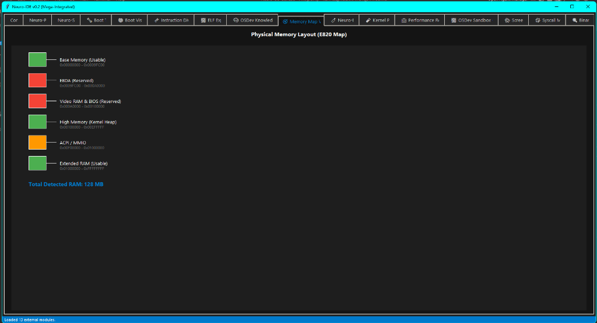
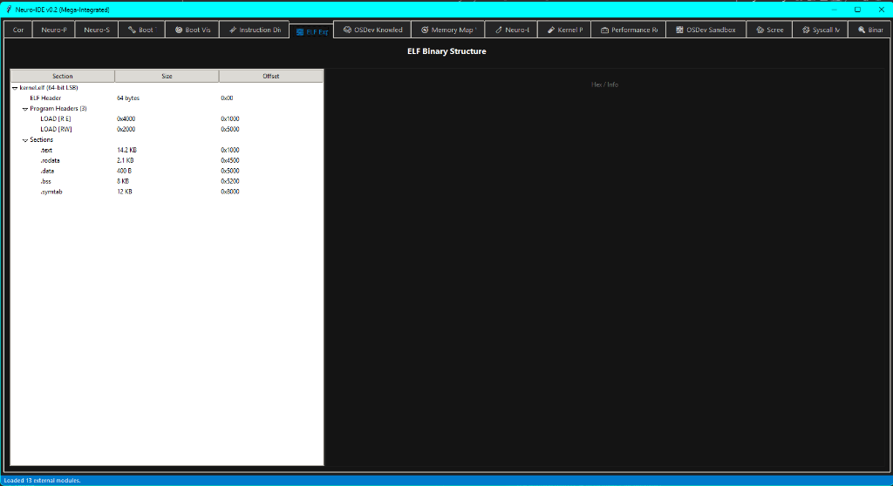

# 🧠 Neuro-IDE v0.2: Mission Control Center
### *Humanizing the Machine | OSDev with Soul*



[](https://opensource.org/licenses/MIT)
[](https://www.python.org/)
[]()

Neuro-IDE is an unmatched tool in the OSDev ecosystem. It is a technical **Cortex** designed to bridge the gap between cold silicon and human understanding. It provides 17 integrated modules to diagnose, visualize, and narrate the birth of your operating system.

---

## 🎭 The Vision: Kernel Storyteller
Why watch dry logs when your kernel can tell its own story? Neuro-IDE features a unique **Narrative Engine** that transforms technical boot events into literal chronologies.
- **5 Modes:** Epic, Technical, Philosophical, Humorous, Self-Aware.
- **Bilingual:** Native support for English and Spanish.
- **Procedural:** Generates unique tales by mixing real kernel events with philosophical interludes.

---

## 🛠️ The Lobes (Integrated Modules)

| Module | Icon | Description |
| :--- | :--- | :--- |
| **Neuro-Doctor** | 🩺 | Heuristic diagnosis for Kernel Panics and #UD. |
| **Neuro-Scope** | 📡 | Real-time timeline of serial logs and events. |
| **BootViz** | 🗺️ | Visual memory map visualizer for boot stages. |
| **ELF Ex** | 🔍 | Deep-dive explorer for 64-bit ELF binaries. |
| **Storyteller** | 🎭 | Procedural narrative engine (The heart of the IDE). |

---

## 🚀 Quick Start
```bash
# Clone the repository
git clone https://github.com/cyberenigma-lgtm/Neuro-IDE-Universal-Kernel-Cortex.git
cd Neuro-IDE-Universal-Kernel-Cortex

# Launch the Cortex
python neuro_ide.py
```

---

## 🇪🇸 Versión en Español: Misión de Control

Neuro-IDE es una herramienta sin parangón. Es una **Corteza** técnica diseñada para unir el silicio frío con la comprensión humana. Proporciona 17 módulos integrados para diagnosticar, visualizar y narrar el nacimiento de tu sistema operativo.

### El Narrador del Kernel
Transforma logs secos en crónicas literarias con 5 modos narrativos (Épico, Técnico, Filosófico, Humorístico, Auto-consciente).

---

## 📚 Documentation & Wiki
Check out our **[Comprehensive Wiki](./docs/wiki/INDEX.md)**:
- **[🌱 Beginner](./docs/wiki/LEVELS.md#beginner)**: Concepts.
- **[⚙️ Intermediate](./docs/wiki/LEVELS.md#intermediate)**: Manual.
- **[🧙 Advanced](./docs/wiki/LEVELS.md#advanced)**: Architecture.
- **[🚀 Real-World Scenarios](./docs/wiki/SCENARIOS.md)**: Troubleshooting.

---

## 🖼️ Visual Gallery

*Cortex Dashboard showing real-time telemetry.*


*BootViz: Physical memory layout visualization.*


*ELF Ex: Deep anatomy of a 64-bit kernel binary.*

---

**Developed by:** José Manuel Moreno Cano / neuro-os genesis
*Built with Python & Tkinter for maximum portability.*
