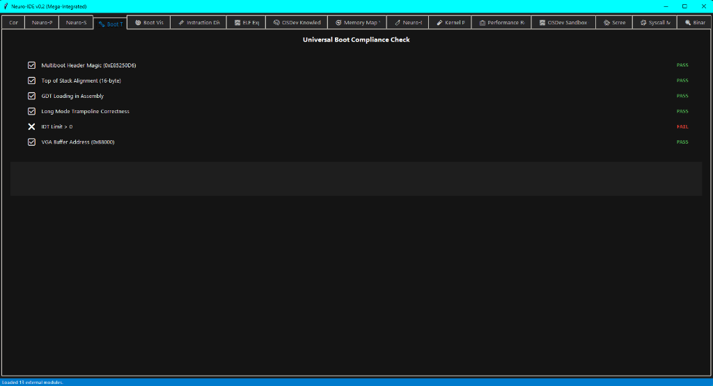

# 🧠 Neuro-IDE v0.2: Mission Control Center
### *Humanizing the Machine | OSDev with Soul*

[](https://opensource.org/licenses/MIT)
[](https://www.python.org/)
[]()

Neuro-IDE is not just a tool; it's a **Cortex**. Designed for the most ambitious OSDev projects, it provides 17 integrated modules to diagnose, visualize, and narrate the birth of your operating system.

---

## 🎭 The Vision: Kernel Storyteller
Why watch dry logs when your kernel can tell its own story? Neuro-IDE features a unique **Narrative Engine** that transforms technical boot events into literal chronologies.

- **5 Modes:** Epic, Technical, Philosophical, Humorous, Self-Aware.
- **Bilingual:** Native support for English and Spanish.
- **Procedural:** Generates unique tales by mixing real kernel events with philosophical interludes.

---

## 🛠️ The Lobes (Integrated Modules)

| Module | Icon | Description |
| :--- | :--- | :--- |
| **Neuro-Doctor** | 🩺 | Heuristic diagnosis for Kernel Panics and #UD. |
| **Neuro-Scope** | 📡 | Real-time timeline of serial logs and events. |
| **BootViz** | 🗺️ | 3D-feeling memory map visualizer for boot stages. |
| **UBD** | 🧩 | Universal Binary Diff for comparing build versions. |
| **Storyteller** | 🎭 | Procedural narrative engine (The heart of the IDE). |
| **Hype-Debug** | 🚀 | KTTD: Mockup for Time-Travel Debugging simulation. |
| **ELF Ex** | 🔍 | Deep-dive explorer for 64-bit ELF binaries. |
| **Sandbox** | 🧪 | OSDev isolated environment generator. |

---

## 🚀 Quick Start
Neuro-IDE follows a **Zero-Dependency** philosophy. You only need a modern Python installation.

```bash
# Clone the repository
git clone https://github.com/cyberenigma-lgtm/Neuro-IDE-Universal-Kernel-Cortex.git
cd Neuro-IDE-Universal-Kernel-Cortex

# Launch the Cortex
python neuro_ide.py
```

---

## 🇪🇸 Versión en Español

Neuro-IDE no es solo una herramienta; es una **Corteza**. Diseñado para los proyectos de OSDev más ambiciosos, proporciona 17 módulos integrados para diagnosticar, visualizar y narrar el nacimiento de tu sistema operativo.

### El Narrador del Kernel
Neuro-IDE incluye un motor narrativo único que transforma eventos técnicos en crónicas literarias.
- **Modos:** Épico, Técnico, Filosófico, Humorístico, Auto-consciente.
- **Procedimental:** Genera historias únicas mezclando logs reales con fragmentos narrativos.

---

## 📚 Documentation & Wiki
For a deep dive into every module, check out our **[Comprehensive Wiki](./docs/wiki/INDEX.md)**.
- **[🌱 Beginner](./docs/wiki/LEVELS.md#beginner)**: Concepts and vision.
- **[⚙️ Intermediate](./docs/wiki/LEVELS.md#intermediate)**: How to use the tools.
- **[🧙 Advanced](./docs/wiki/LEVELS.md#advanced)**: Technical architecture.
- **[🚀 Real-World Scenarios](./docs/wiki/SCENARIOS.md)**: Solving common OSDev issues.

---

## 🖼️ Visual Gallery
````carousel

<!-- slide -->

<!-- slide -->

<!-- slide -->

<!-- slide -->

````
*Check the [GALLERY.md](./GALLERY.md) for a full breakdown of all 17 modules.*

---

**Developed by:** José Manuel Moreno Cano / neuro-os genesis
*Built with Python & Tkinter for maximum portability.*
