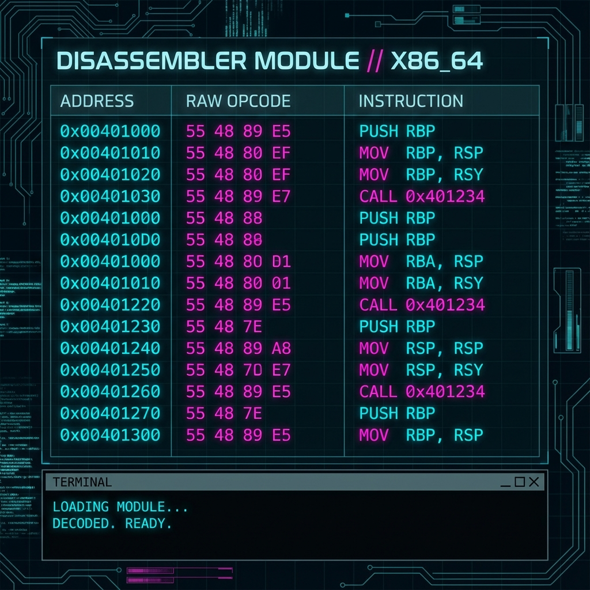

# ⚙️ Disassembler: Binary Transparency

## 🇺🇸 English
### What is it?
Our Disassembler module provides an interactive look into the x86_64 instructions being executed. It maps binary opcodes to human-readable assembly, allowing you to verify compiler output.

### How to use it?
1. Select an ELF binary or a memory region.
2. Browse through the instructions.
3. Use the **Symbol lookup** to jump directly to specific function labels.
4. Contrast the ASM output with your C source to find optimization bottlenecks.

---

## 🇪🇸 Español
### ¿Qué es?
Nuestro módulo Disassembler proporciona una vista interactiva de las instrucciones x86_64 que se están ejecutando. Mapea los opcodes binarios a ensamblador legible, permitiéndote verificar la salida del compilador.

### ¿Cómo usarlo?
1. Selecciona un binario ELF o una región de memoria.
2. Navega a través de las instrucciones.
3. Usa la **búsqueda de símbolos** para saltar directamente a etiquetas de funciones específicas.
4. Contrasta la salida ASM con tu código fuente C para encontrar cuellos de botella de optimización.
