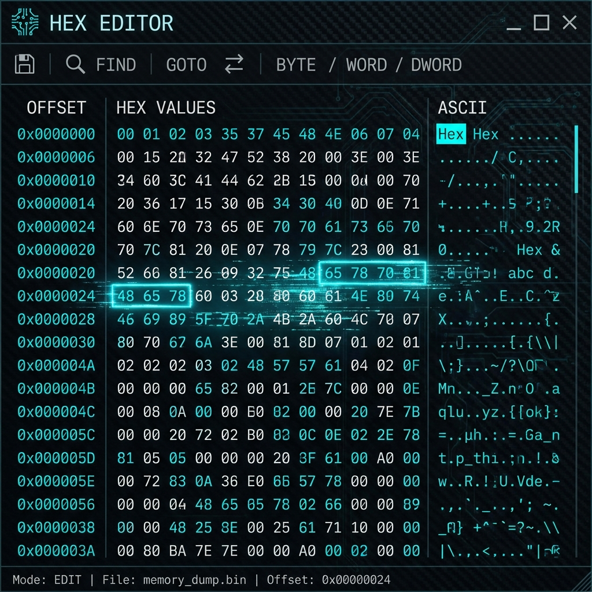

# 🛠️ Hex Editor: Surgical Byte Manipulation

## 🇺🇸 English
### What is it?
The Hex Editor is a professional low-level tool for inspecting and modifying raw binary data. It features offset tracking, cross-reference (ASCII/Hex), and bookmarks for critical kernel segments.

### How to use it?
1. Load any binary file or memory dump.
2. Select a byte to see its different representations (INT8, INT16, etc.).
3. Modify bytes directly and use **"Safe Save"** to prevent corruption.
4. Search for specific patterns (e.g., magic numbers like `0xAA55`).

---

## 🇪🇸 Español
### ¿Qué es?
El Hex Editor es una herramienta profesional de bajo nivel para inspeccionar y modificar datos binarios puros. Cuenta con seguimiento de desplazamiento, referencia cruzada (ASCII/Hex) y marcadores para segmentos críticos del kernel.

### ¿Cómo usarlo?
1. Carga cualquier archivo binario o volcado de memoria.
2. Selecciona un byte para ver sus diferentes representaciones (INT8, INT16, etc.).
3. Modifica los bytes directamente y usa **"Safe Save"** para evitar la corrupción.
4. Busca patrones específicos (por ejemplo, números mágicos como `0xAA55`).
