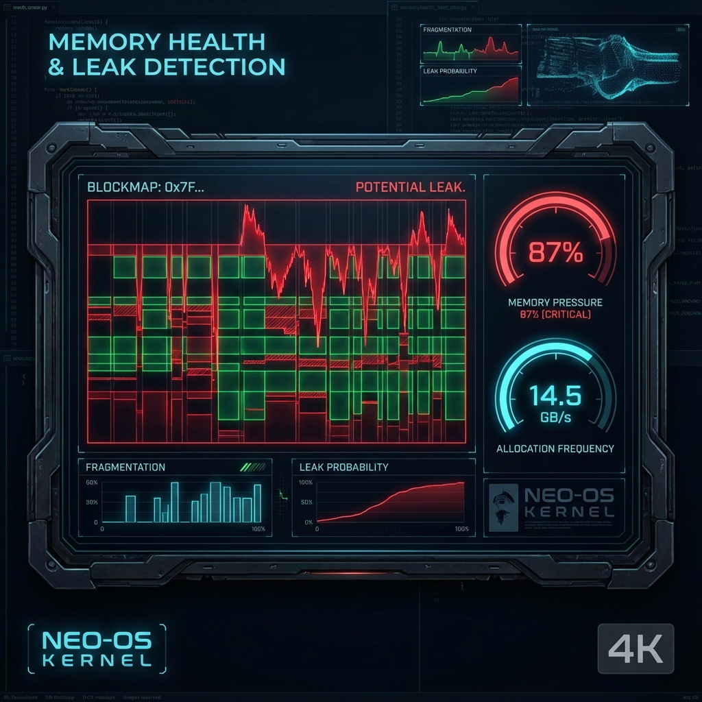

# 🏥 Memory Health & Leak Detection

## 🇺🇸 English
### What is it?
This tool acts as a "Guardian" for your kernel's heap. It monitors allocations and deallocations in real-time, visualizing fragmentation and identifying memory that has been orphaned (leaks).

### How to use it?
1. Enable memory logging in your kernel's allocation functions.
2. Observe the **Memory Heatmap** to see how physical space is being occupied.
3. Look for red blocks in the map; these represent allocations that were never freed.
4. Click a block to see the stack trace of who allocated it.

---

## 🇪🇸 Español
### ¿Qué es?
Esta herramienta actúa como un "Guardián" para el heap de tu kernel. Monitoriza las asignaciones y liberaciones en tiempo real, visualizando la fragmentación e identificando la memoria que ha quedado huérfana (fugas).

### ¿Cómo usarlo?
1. Activa el registro de memoria en las funciones de asignación de tu kernel.
2. Observa el **Mapa de Calor de Memoria** para ver cómo se está ocupando el espacio físico.
3. Busca bloques rojos en el mapa; estos representan asignaciones que nunca fueron liberadas.
4. Haz clic en un bloque para ver la traza de quién lo asignó.
