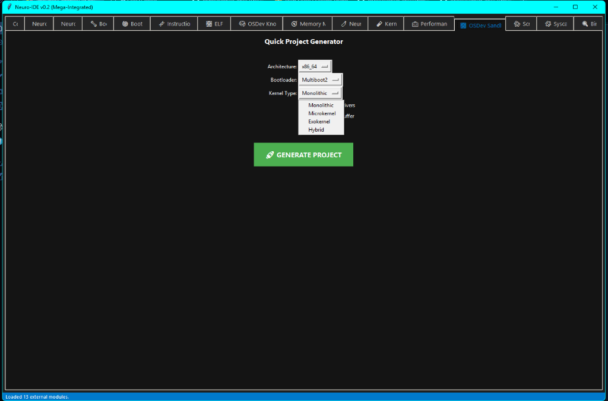
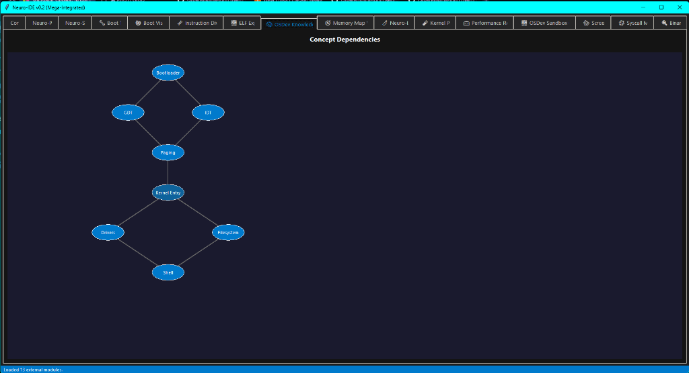

# 🧬 Sandbox & Knowledge Graph

| Sandbox | Knowledge Graph |
| :--- | :--- |
|  |  |

## 🇺🇸 English
### What is it?
- **Sandbox:** A quick project generator that creates isolated OSDev environments for safe testing.
- **Knowledge Graph:** A visual dependency map showing how different modules and concepts in your kernel interact.

### How to use it?
- **Sandbox:** Define your architecture (x86_64) and click "Generate". It creates a template folder with a minimal kernel.
- **Knowledge Graph:** Feed your project structure to the IDE; it will generate nodes representing modules. Click nodes to see what depends on them.

---

## 🇪🇸 Español
### ¿Qué es?
- **Sandbox:** Un generador rápido de proyectos que crea entornos de OSDev aislados para pruebas seguras.
- **Knowledge Graph:** Un mapa visual de dependencias que muestra cómo interactúan los diferentes módulos y conceptos de tu kernel.

### ¿Cómo usarlo?
- **Sandbox:** Define tu arquitectura (x86_64) y pulsa "Generate". Creará una carpeta de plantilla con un kernel mínimo.
- **Knowledge Graph:** Carga la estructura de tu proyecto; el IDE generará nodos. Pulsa en ellos para ver qué dependencias tienen.
