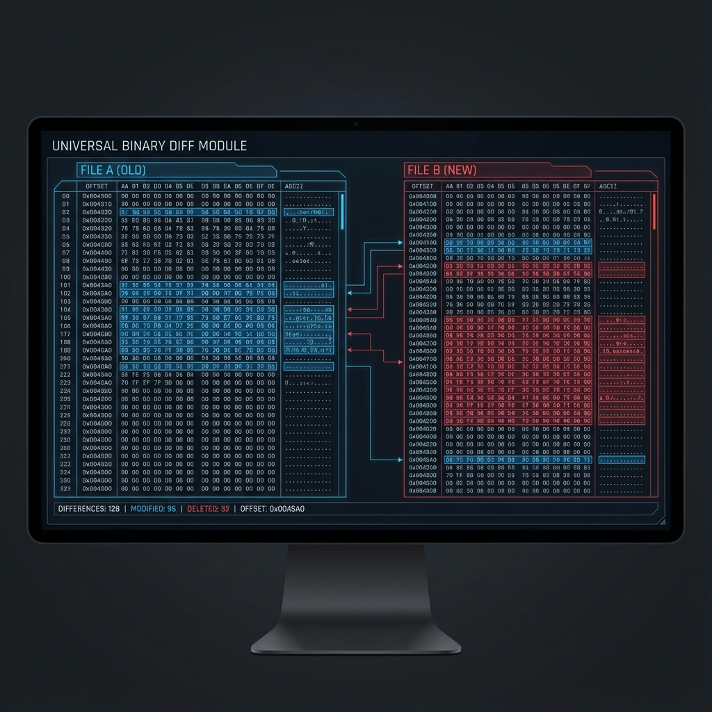

# ⚖️ Universal Binary Diff (UBD)

## 🇺🇸 English
### What is it?
UBD is a high-precision comparison tool for binary versions. It highlights exactly what changed between two builds of your kernel, from single bits to entire data sections.

### How to use it?
1. Load **Version A** (Stable) and **Version B** (Current).
2. The IDE will perform a bitwise differential analysis.
3. Review the **Diff Map** to see which sections of the file were modified.
4. Critical for finding why a small code change caused a major binary shift.

---

## 🇪🇸 Español
### ¿Qué es?
UBD es una herramienta de comparación de alta precisión para versiones binarias. Resalta exactamente qué cambió entre dos versiones de tu kernel, desde bits individuales hasta secciones de datos completas.

### ¿Cómo usarlo?
1. Carga la **Versión A** (Estable) y la **Versión B** (Actual).
2. El IDE realizará un análisis diferencial bit a bit.
3. Revisa el **Diff Map** para ver qué secciones del archivo fueron modificadas.
4. Crítico para encontrar por qué un pequeño cambio de código causó un gran cambio binario.
